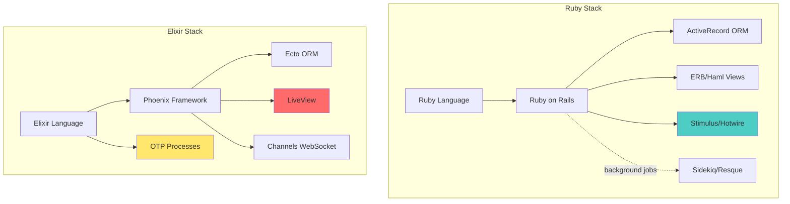

# Обзор экосистемы Elixir/Phoenix

## Что такое Elixir?

**Elixir** — функциональный язык программирования, работающий на виртуальной машине BEAM (Erlang VM). Создан José Valim (core team member Rails) в 2011 году.

### Почему BEAM особенная?

BEAM VM разрабатывалась Ericsson с 1986 года для телекоммуникационных систем, где:
- Простой (downtime) недопустим (99.9999999% uptime — 9 девяток!)
- Миллионы одновременных подключений
- Soft real-time требования

```
BEAM VM = "телефонная станция в коде"
```

## Где и зачем используется Elixir?

### 🎯 Идеальные use cases:

| Задача | Почему Elixir | Примеры компаний |
|--------|---------------|------------------|
| **Real-time приложения** | WebSocket из коробки, миллионы соединений | WhatsApp (2M+ connections/server), Discord |
| **Chat, messaging** | Процессы = пользователи, изоляция | Discord (5M+ concurrent users) |
| **Streaming, events** | Backpressure, GenStage, Flow | Bleacher Report, Moz |
| **IoT, embedded** | Nerves framework, fault-tolerance | Tesla, FarmBot |
| **High-load APIs** | Конкурентность без потоков, быстрый response | Pinterest, PepsiCo |
| **Финтех** | Fault-tolerance, ACID на уровне процессов | Nubank (крупнейший банк Latam) |

### ⚠️ Когда Elixir НЕ нужен:

- CRUD приложения с малой нагрузкой → Rails проще
- CPU-intensive вычисления (ML, video processing) → Python/Rust
- Большая команда джуниоров без FP опыта → Rails/Django
- Богатая экосистема нужна прямо сейчас → Node.js

## Сравнение стеков: Rails vs Phoenix



### Детальное сравнение компонентов

| Концепт | Ruby/Rails | Elixir/Phoenix | Разница |
|---------|-----------|----------------|---------|
| **Язык** | Ruby (ООП) | Elixir (Функциональный) | Иммутабельность, pattern matching |
| **Framework** | Rails (батарейки included) | Phoenix (легче, модульнее) | Phoenix ~200ms boot vs Rails ~10s |
| **ORM** | ActiveRecord | Ecto | Explicit queries, changesets |
| **Routing** | routes.rb | router.ex | Аналогично |
| **Controllers** | controllers/ | controllers/ | Аналогично |
| **Models** | models/ | contexts/ + schemas/ | Больше разделения ответственности |
| **Views** | ERB/Haml | EEx/HEEx templates | Почти идентично |
| **Real-time** | ActionCable/Hotwire | Phoenix Channels + LiveView | Channels = масштабируемый WebSocket |
| **Background jobs** | Sidekiq (Redis) | GenServer/Task/Oban | Встроено в язык! |
| **Testing** | RSpec/Minitest | ExUnit | Встроено, быстрее |
| **Package manager** | Bundler (gems) | Mix + Hex | Аналогично |
| **Console** | rails console | iex -S mix | Interactive Elixir |
| **Server** | Puma/Unicorn | Cowboy | Встроен в Phoenix |

## Экосистема Elixir

### Ключевые компоненты

```
┌─────────────────────────────────────────────┐
│           BEAM VM (Erlang)                  │
│  - Процессы (actor model)                   │
│  - Fault tolerance (supervisors)            │
│  - Distribution (кластеры)                  │
└─────────────────────────────────────────────┘
                    ▲
                    │
┌─────────────────────────────────────────────┐
│              Elixir Language                │
│  - Синтаксис (Ruby-like)                    │
│  - Макросы                                  │
│  - Протоколы (как интерфейсы)               │
└─────────────────────────────────────────────┘
                    ▲
        ┌───────────┼───────────┐
        │           │           │
┌───────▼────┐ ┌───▼─────┐ ┌──▼──────────┐
│  Phoenix   │ │  Ecto   │ │ OTP (stdlib)│
│  Web       │ │  DB     │ │ GenServer   │
│  Framework │ │  Layer  │ │ Supervisor  │
└────────────┘ └─────────┘ └─────────────┘
        │
   ┌────┴────┐
   │         │
┌──▼────┐ ┌─▼────────┐
│LiveView│ │Channels  │
│Reactive│ │WebSocket │
└────────┘ └──────────┘
```

### Основные библиотеки

| Библиотека | Аналог в Ruby | Назначение |
|------------|---------------|------------|
| **Phoenix** | Rails | Web framework |
| **Ecto** | ActiveRecord | Database wrapper, queries, schemas |
| **LiveView** | Hotwire/Stimulus | Server-side реактивность |
| **Plug** | Rack | HTTP middleware |
| **Mix** | Rake + Bundler | Build tool + deps |
| **ExUnit** | RSpec/Minitest | Testing |
| **Oban** | Sidekiq | Background jobs |
| **Jason** | JSON gem | JSON parsing |
| **Tesla** | HTTParty/Faraday | HTTP client |
| **Absinthe** | GraphQL-ruby | GraphQL |

## Когда выбирать Elixir vs Ruby?

### Выбирай **Elixir**, если:

✅ Нужна высокая конкурентность (1000+ одновременных операций)  
✅ Real-time фичи (чат, live updates, collaborative editing)  
✅ Fault-tolerance критична (финтех, healthcare)  
✅ Долгоживущие connections (WebSocket, SSE)  
✅ Команда готова к функциональному программированию  
✅ Масштабирование по горизонтали (распределенные системы)  

### Выбирай **Ruby/Rails**, если:

✅ CRUD приложение, небольшой трафик  
✅ Быстрый MVP, прототип  
✅ Большая команда джуниоров  
✅ Нужны тонны готовых gem'ов  
✅ Много работы с legacy API/интеграциями  
✅ Scripting, автоматизация, DevOps задачи  

## Что особенного в Elixir для Rails-разработчика?

### 1. **Конкурентность почти бесплатно**

```ruby
# Ruby - тяжелые потоки OS
threads = 1000.times.map do
  Thread.new { do_work() }
end
# Медленно, много памяти
```

```elixir
# Elixir - легковесные процессы BEAM
tasks = for _ <- 1..1000 do
  Task.async(fn -> do_work() end)
end
# Быстро, ~2KB на процесс
```

### 2. **Pattern Matching вместо if/case**

```ruby
# Ruby
def handle(response)
  if response.success?
    process(response.body)
  else
    handle_error(response.error)
  end
end
```

```elixir
# Elixir
def handle({:ok, body}), do: process(body)
def handle({:error, reason}), do: handle_error(reason)
```

### 3. **Иммутабельность = no side effects**

```ruby
# Ruby - мутации везде
user.name = "John"
users << new_user
hash[:key] = value
```

```elixir
# Elixir - только новые значения
user = %{user | name: "John"}
users = [new_user | users]
map = Map.put(map, :key, value)
```

### 4. **Pipe operator - читаемые цепочки**

```ruby
# Ruby
User.active
    .where(role: :admin)
    .order(:created_at)
    .limit(10)
```

```elixir
# Elixir
User
|> where([u], u.active == true)
|> where([u], u.role == :admin)
|> order_by(:created_at)
|> limit(10)
```

## Цифры производительности

| Метрика | Ruby/Rails | Elixir/Phoenix | Множитель |
|---------|-----------|----------------|-----------|
| Requests/sec | ~5,000 | ~100,000 | **20x** |
| Latency (p99) | ~100ms | ~10ms | **10x** |
| Concurrent connections | ~5,000 | ~2,000,000 | **400x** |
| Memory per request | ~5MB | ~2KB | **2500x** |
| Boot time | ~10s | ~200ms | **50x** |

*Данные для типичного CRUD API на одном сервере*

## Философия: Rails vs Phoenix

```
Rails: "Convention over Configuration"
└─ Всё есть из коробки, но тяжелое и "магическое"

Phoenix: "Explicit over Implicit"  
└─ Пиши больше, но понимай всё, что происходит
```

**Пример:**

```ruby
# Rails - магия
has_many :posts, dependent: :destroy
# Что происходит? Хз, Rails решает

# Phoenix/Ecto - явно
def delete_user_with_posts(user) do
  Repo.transaction(fn ->
    Repo.delete_all(from p in Post, where: p.user_id == ^user.id)
    Repo.delete(user)
  end)
end
# Видно ЧТО и КАК удаляется
```

## Кривая обучения

```
Сложность
   ▲
   │     ┌─────── Ruby/Rails (долгий plateau)
   │    ╱
   │   ╱
   │  ╱         ┌─── Elixir/Phoenix (крутой старт, потом легче)
   │ ╱        ╱
   │╱       ╱
   └────────────────────────────────▶ Время
   
   День  Неделя  Месяц  Полгода
```

- **Ruby/Rails**: легкий старт, но сложности с production (память, конкурентность)
- **Elixir/Phoenix**: сложнее начало (FP, новые концепты), но проще масштабировать

## Следующий шаг

Переходи к **01-language-basics.md** для изучения синтаксиса и основ языка Elixir.

---

**Полезные ссылки:**
- [Elixir официальный сайт](https://elixir-lang.org/)
- [Phoenix Framework](https://www.phoenixframework.org/)
- [Elixir School](https://elixirschool.com/ru) - туториалы на русском
- [Awesome Elixir](https://github.com/h4cc/awesome-elixir) - список библиотек

