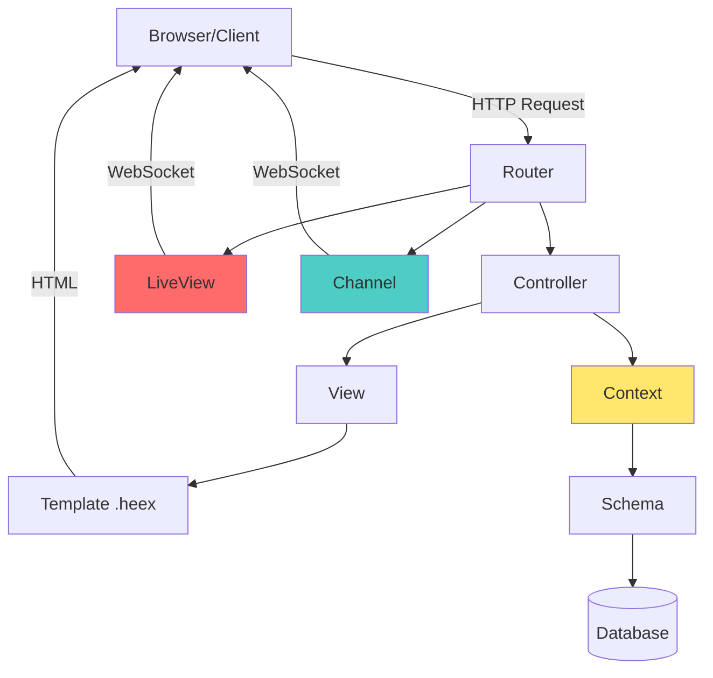
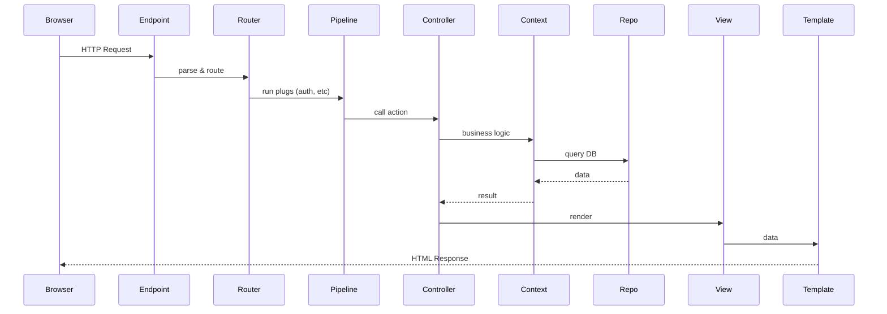

# Phoenix Framework vs Rails

## Архитектура Phoenix



## Сравнение компонентов: Rails → Phoenix

| Rails | Phoenix | Назначение |
|-------|---------|------------|
| `config/routes.rb` | `lib/app_web/router.ex` | Маршрутизация |
| `app/controllers/` | `lib/app_web/controllers/` | Обработчики запросов |
| `app/models/` | `lib/app/contexts/` + `schemas/` | Бизнес-логика + данные |
| `app/views/` | `lib/app_web/views/` | Подготовка данных для шаблонов |
| `app/views/*.erb` | `lib/app_web/templates/*.heex` | HTML шаблоны |
| ActiveRecord | Ecto (Query, Schema, Changeset) | Работа с БД |
| `app/channels/` | `lib/app_web/channels/` | WebSocket |
| Hotwire/Stimulus | LiveView | Реактивность |
| `lib/` | `lib/app/` | Бизнес-логика |
| `config/application.rb` | `config/config.exs` | Конфигурация |
| `db/migrate/` | `priv/repo/migrations/` | Миграции |
| Rack middleware | Plug pipeline | HTTP middleware |

## Структура проекта

### Rails структура
```
my_app/
├── app/
│   ├── controllers/
│   ├── models/
│   ├── views/
│   ├── helpers/
│   └── assets/
├── config/
│   ├── routes.rb
│   └── database.yml
├── db/
│   └── migrate/
└── lib/
```

### Phoenix структура
```
my_app/
├── lib/
│   ├── my_app/              # Бизнес-логика (как Rails lib/)
│   │   ├── accounts/        # Context (группа связанной логики)
│   │   │   ├── user.ex      # Schema
│   │   │   └── account.ex   # Context module
│   │   └── repo.ex          # Database repository
│   └── my_app_web/          # Web-слой (как Rails app/)
│       ├── controllers/
│       ├── views/
│       ├── templates/       # или components/ в Phoenix 1.7+
│       ├── live/            # LiveView компоненты
│       ├── channels/        # WebSocket каналы
│       └── router.ex        # Routes
├── priv/
│   └── repo/
│       └── migrations/
├── config/
│   ├── config.exs
│   └── dev.exs
└── assets/                  # Frontend (JS, CSS)
```

**Ключевое отличие:** В Phoenix четкое разделение бизнес-логики (`lib/my_app/`) и веб-слоя (`lib/my_app_web/`).

## Request Lifecycle

### Rails Request Flow

```
Request → Routing → Controller → Model → View → Response
```

### Phoenix Request Flow



### Детальнее по шагам

| Шаг | Rails | Phoenix | Описание |
|-----|-------|---------|----------|
| 1 | Rack | Endpoint | Точка входа HTTP |
| 2 | Routes | Router | Определение маршрута |
| 3 | Middleware | Plug Pipeline | before_action, auth, etc |
| 4 | Controller | Controller | Обработчик запроса |
| 5 | Model/Service | Context | Бизнес-логика |
| 6 | ActiveRecord | Ecto.Repo | Запрос в БД |
| 7 | View | View | Подготовка данных |
| 8 | ERB/Haml | HEEx | Рендеринг HTML |

## Routing: routes.rb vs router.ex

### Rails
```ruby
# config/routes.rb
Rails.application.routes.draw do
  root "pages#home"
  
  resources :posts do
    member do
      post :publish
    end
    resources :comments
  end
  
  namespace :admin do
    resources :users
  end
  
  get "/about", to: "pages#about"
end
```

### Phoenix
```elixir
# lib/my_app_web/router.ex
defmodule MyAppWeb.Router do
  use MyAppWeb, :router

  pipeline :browser do
    plug :accepts, ["html"]
    plug :fetch_session
    plug :fetch_flash
    plug :protect_from_forgery
  end

  pipeline :api do
    plug :accepts, ["json"]
  end

  scope "/", MyAppWeb do
    pipe_through :browser

    get "/", PageController, :home
    get "/about", PageController, :about
    
    resources "/posts", PostController do
      post "/publish", PostController, :publish
      resources "/comments", CommentController
    end
  end

  scope "/admin", MyAppWeb.Admin do
    pipe_through [:browser, :require_admin]
    
    resources "/users", UserController
  end
end
```

**Ключевые отличия:**
- Phoenix: явные `pipeline` (группы middleware)
- Phoenix: `scope` для группировки с общими префиксами
- Phoenix: `pipe_through` для применения pipeline

## Controllers

### Rails Controller
```ruby
# app/controllers/posts_controller.rb
class PostsController < ApplicationController
  before_action :authenticate_user!
  before_action :set_post, only: [:show, :edit, :update]

  def index
    @posts = Post.all.order(created_at: :desc)
  end

  def show
    # @post уже установлен
  end

  def create
    @post = Post.new(post_params)
    
    if @post.save
      redirect_to @post, notice: "Post created"
    else
      render :new, status: :unprocessable_entity
    end
  end

  private

  def set_post
    @post = Post.find(params[:id])
  end

  def post_params
    params.require(:post).permit(:title, :body)
  end
end
```

### Phoenix Controller
```elixir
# lib/my_app_web/controllers/post_controller.ex
defmodule MyAppWeb.PostController do
  use MyAppWeb, :controller
  
  alias MyApp.Blog  # Context
  alias MyApp.Blog.Post

  plug :authenticate_user
  plug :load_post when action in [:show, :edit, :update]

  def index(conn, _params) do
    posts = Blog.list_posts()
    render(conn, "index.html", posts: posts)
  end

  def show(conn, _params) do
    post = conn.assigns.post  # Загружен в plug
    render(conn, "show.html", post: post)
  end

  def create(conn, %{"post" => post_params}) do
    case Blog.create_post(post_params) do
      {:ok, post} ->
        conn
        |> put_flash(:info, "Post created")
        |> redirect(to: Routes.post_path(conn, :show, post))
      
      {:error, %Ecto.Changeset{} = changeset} ->
        render(conn, "new.html", changeset: changeset)
    end
  end

  defp load_post(conn, _opts) do
    post = Blog.get_post!(conn.params["id"])
    assign(conn, :post, post)
  end
end
```

**Ключевые отличия:**
- Phoenix: `conn` (connection) передается через все функции
- Phoenix: нет инстанс-переменных (`@posts`), используется `render(conn, assigns)`
- Phoenix: функции чистые, нет side effects
- Phoenix: `plug` вместо `before_action`

## Models → Contexts + Schemas

### Rails Model
```ruby
# app/models/user.rb
class User < ApplicationRecord
  has_many :posts
  
  validates :email, presence: true, uniqueness: true
  
  def full_name
    "#{first_name} #{last_name}"
  end
  
  # Бизнес-логика часто здесь же
  def publish_post(post)
    post.update(published: true, published_at: Time.now)
    UserMailer.post_published(self, post).deliver_later
  end
end

# Использование
user = User.find(1)
user.publish_post(post)
```

### Phoenix: Context + Schema

```elixir
# lib/my_app/accounts/user.ex (Schema - только данные!)
defmodule MyApp.Accounts.User do
  use Ecto.Schema
  import Ecto.Changeset

  schema "users" do
    field :email, :string
    field :first_name, :string
    field :last_name, :string
    
    has_many :posts, MyApp.Blog.Post
    
    timestamps()
  end

  def changeset(user, attrs) do
    user
    |> cast(attrs, [:email, :first_name, :last_name])
    |> validate_required([:email])
    |> validate_format(:email, ~r/@/)
    |> unique_constraint(:email)
  end
  
  def full_name(%__MODULE__{first_name: first, last_name: last}) do
    "#{first} #{last}"
  end
end

# lib/my_app/accounts.ex (Context - бизнес-логика!)
defmodule MyApp.Accounts do
  alias MyApp.Repo
  alias MyApp.Accounts.User

  def get_user!(id), do: Repo.get!(User, id)
  
  def list_users, do: Repo.all(User)
  
  def create_user(attrs) do
    %User{}
    |> User.changeset(attrs)
    |> Repo.insert()
  end
end

# lib/my_app/blog.ex (Context для постов)
defmodule MyApp.Blog do
  alias MyApp.Repo
  alias MyApp.Blog.Post

  def publish_post(post, user) do
    post
    |> Post.publish_changeset()
    |> Repo.update()
    |> case do
      {:ok, post} ->
        MyApp.Mailer.post_published(user, post)
        {:ok, post}
      error -> error
    end
  end
end

# Использование
user = Accounts.get_user!(1)
Blog.publish_post(post, user)
```

**Философия Phoenix:**
- **Schema** = только структура данных + валидации
- **Context** = бизнес-логика, API для работы с группой схем
- Четкое разделение ответственности

## ActiveRecord vs Ecto

### Rails (ActiveRecord)
```ruby
# Создание
user = User.create(name: "John", email: "john@ex.com")

# Чтение
users = User.where(active: true).order(:created_at).limit(10)
user = User.find(1)
user = User.find_by(email: "john@ex.com")

# Обновление
user.update(name: "Jane")
user.name = "Jane"
user.save

# Удаление
user.destroy

# Связи
user.posts.create(title: "Hello")
user.posts.where(published: true)

# Валидация
user.valid?
user.errors.full_messages
```

### Phoenix (Ecto)
```elixir
# Создание (через changeset!)
changeset = User.changeset(%User{}, %{name: "John", email: "john@ex.com"})
{:ok, user} = Repo.insert(changeset)

# Чтение (явные запросы!)
users = User
|> where([u], u.active == true)
|> order_by(:created_at)
|> limit(10)
|> Repo.all()

user = Repo.get(User, 1)
user = Repo.get_by(User, email: "john@ex.com")

# Обновление (через changeset!)
changeset = User.changeset(user, %{name: "Jane"})
{:ok, user} = Repo.update(changeset)

# Удаление
{:ok, _} = Repo.delete(user)

# Связи (через preload!)
user = Repo.preload(user, :posts)
posts = user.posts  # Теперь загружены

# Или в запросе
user = User
|> where([u], u.id == ^user_id)
|> preload(:posts)
|> Repo.one()

# Валидация
changeset = User.changeset(%User{}, attrs)
changeset.valid?  # true/false
Ecto.Changeset.traverse_errors(changeset, &translate_error/1)
```

**Ключевые отличия:**
- Ecto: явные запросы, нет "магии"
- Ecto: changeset для валидации и изменений
- Ecto: явный `preload` для связей (решает N+1 problem)
- Ecto: возвращает `{:ok, result}` или `{:error, changeset}`

## Views и Templates

### Rails
```ruby
# app/views/posts/index.html.erb
<h1>Posts</h1>

<% @posts.each do |post| %>
  <div class="post">
    <h2><%= post.title %></h2>
    <p><%= truncate(post.body, length: 100) %></p>
    <%= link_to "Read more", post %>
  </div>
<% end %>
```

### Phoenix (старый стиль)
```elixir
# lib/my_app_web/templates/post/index.html.heex
<h1>Posts</h1>

<%= for post <- @posts do %>
  <div class="post">
    <h2><%= post.title %></h2>
    <p><%= truncate(post.body, 100) %></p>
    <%= link "Read more", to: Routes.post_path(@conn, :show, post) %>
  </div>
<% end %>
```

### Phoenix 1.7+ (Function Components)
```elixir
# lib/my_app_web/controllers/post_html.ex
defmodule MyAppWeb.PostHTML do
  use MyAppWeb, :html

  embed_templates "post_html/*"
  
  def post_card(assigns) do
    ~H"""
    <div class="post">
      <h2><%= @post.title %></h2>
      <p><%= truncate(@post.body, 100) %></p>
      <.link navigate={~p"/posts/#{@post}"}>Read more</.link>
    </div>
    """
  end
end

# lib/my_app_web/controllers/post_html/index.html.heex
<h1>Posts</h1>

<div class="posts">
  <.post_card :for={post <- @posts} post={post} />
</div>
```

**Phoenix 1.7+:** Компонентный подход, как в React!

## Mix Tasks vs Rake Tasks

### Rails
```bash
# Rake tasks
rake db:create
rake db:migrate
rake db:seed
rake routes
rake test

rails console
rails server
rails generate model User email:string
```

### Phoenix
```bash
# Mix tasks
mix ecto.create
mix ecto.migrate
mix run priv/repo/seeds.exs
mix phx.routes
mix test

iex -S mix                    # interactive console
mix phx.server               # запуск сервера
mix phx.gen.schema User users email:string
mix phx.gen.context Accounts User users email:string
mix phx.gen.html Accounts User users email:string  # полный CRUD
```

## Plug Pipeline (Middleware)

### Rails
```ruby
class ApplicationController < ActionController::Base
  before_action :authenticate_user!
  before_action :set_locale
  
  def set_locale
    I18n.locale = params[:locale] || I18n.default_locale
  end
end
```

### Phoenix
```elixir
# В router.ex
pipeline :browser do
  plug :accepts, ["html"]
  plug :fetch_session
  plug :fetch_flash
  plug :protect_from_forgery
  plug :put_secure_browser_headers
  plug MyAppWeb.Plugs.SetLocale
end

# lib/my_app_web/plugs/set_locale.ex
defmodule MyAppWeb.Plugs.SetLocale do
  import Plug.Conn

  def init(default), do: default

  def call(conn, _default) do
    locale = conn.params["locale"] || "en"
    Gettext.put_locale(MyAppWeb.Gettext, locale)
    conn
  end
end

# В контроллере
plug :authenticate_user when action in [:create, :update, :delete]
```

**Plug** — это функция, которая принимает `conn` и возвращает `conn`. Очень простая концепция!

## Конфигурация

### Rails
```ruby
# config/database.yml
development:
  adapter: postgresql
  database: myapp_dev
  
# config/application.rb
config.time_zone = "UTC"
config.i18n.default_locale = :en
```

### Phoenix
```elixir
# config/dev.exs
config :my_app, MyApp.Repo,
  username: "postgres",
  password: "postgres",
  database: "my_app_dev"

config :my_app, MyAppWeb.Endpoint,
  http: [port: 4000],
  debug_errors: true,
  code_reloader: true

# config/config.exs
config :my_app,
  timezone: "UTC"

import_config "#{config_env()}.exs"
```

## Чеклист различий для Rails-разработчика

### Архитектура
- ✅ Разделение: `lib/my_app/` (логика) и `lib/my_app_web/` (web)
- ✅ Contexts вместо толстых моделей
- ✅ Явные запросы Ecto вместо ActiveRecord magic

### Контроллеры
- ✅ `conn` передается через все функции
- ✅ Нет инстанс-переменных, все через `assigns`
- ✅ `plug` вместо `before_action`
- ✅ Pattern matching в экшенах

### Модели → Схемы
- ✅ Schema = только данные + валидации
- ✅ Context = бизнес-логика
- ✅ Changeset для всех изменений
- ✅ `{:ok, result}` / `{:error, changeset}` паттерн

### Запросы
- ✅ Явный `Repo.all()`, `Repo.get()`, etc
- ✅ Явный `preload` для ассоциаций
- ✅ Query через pipe operator
- ✅ Нет ленивых запросов (lazy loading)

### Общее
- ✅ Функции вместо методов
- ✅ Иммутабельность везде
- ✅ Pattern matching вместо условий
- ✅ Mix вместо Rake/Bundler

## Следующий шаг

Переходи к **03-liveview.md** для изучения Phoenix LiveView — самой мощной фичи Phoenix!

---

**Полезные ссылки:**
- [Phoenix Documentation](https://hexdocs.pm/phoenix/overview.html)
- [Ecto Documentation](https://hexdocs.pm/ecto/Ecto.html)
- [Phoenix Guides](https://hexdocs.pm/phoenix/up_and_running.html)

