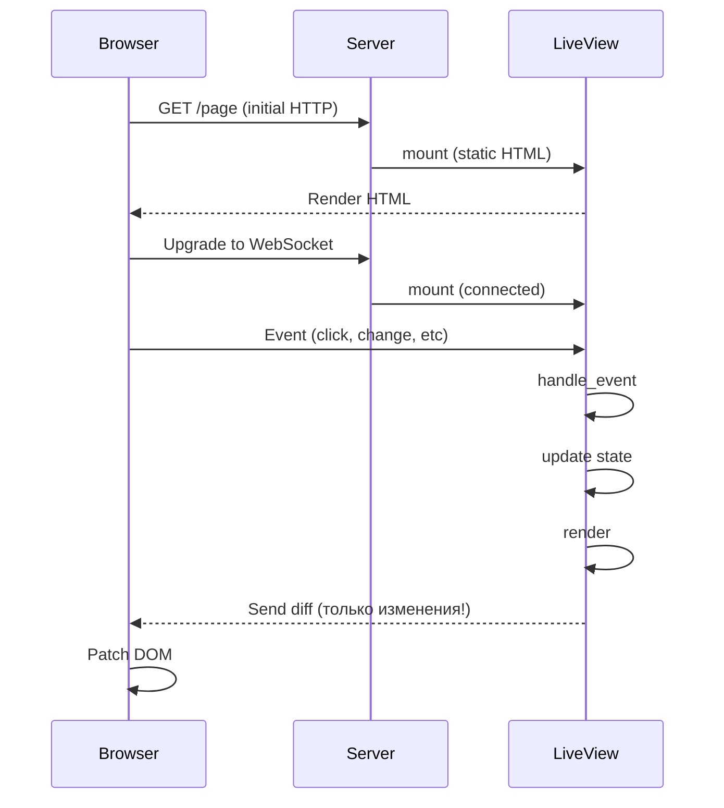
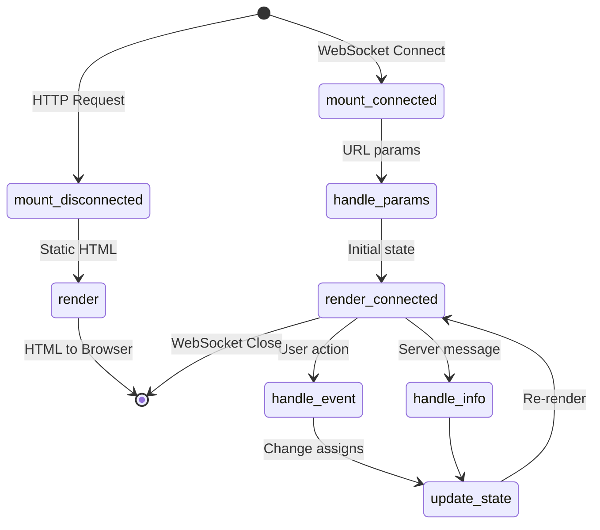

# Phoenix LiveView — Реактивность на сервере

## Что такое LiveView?

**LiveView** — это библиотека Phoenix, которая позволяет создавать интерактивные, реактивные интерфейсы **без написания JavaScript**. Вся логика на сервере, UI обновляется через WebSocket.

```
LiveView = "React на сервере + WebSocket"
```

### Как это работает?



### Сравнение с другими подходами

| Подход | Где логика | Трафик | Состояние | Когда использовать |
|--------|------------|--------|-----------|-------------------|
| **Traditional MPA** | Сервер | Полные страницы | Нет | Простые формы |
| **SPA (React/Vue)** | Клиент | JSON API | Клиент + сервер | Сложные интерфейсы |
| **Hotwire/Turbo** | Сервер | HTML фрагменты | Сервер | Средняя интерактивность |
| **LiveView** | Сервер | WebSocket diff | Сервер | Real-time, interactive |

### Преимущества LiveView

✅ **Нет дублирования логики** — вся валидация, бизнес-логика на сервере  
✅ **Меньше JS** — не нужен React/Vue для интерактивности  
✅ **Real-time из коробки** — WebSocket встроен  
✅ **SEO-friendly** — первый рендер статичный HTML  
✅ **Безопасность** — логика не видна клиенту  
✅ **Простота** — одна кодовая база  

### Недостатки LiveView

⚠️ **Latency** — каждое действие идет на сервер (не для high-frequency)  
⚠️ **Offline** — без WebSocket не работает  
⚠️ **Нагрузка на сервер** — больше нагрузки, чем SPA  
⚠️ **Сложная анимация** — лучше делать на клиенте  

## LiveView Lifecycle



### Этапы жизненного цикла

1. **`mount/3` (disconnected)** — первый HTTP запрос, статичный HTML
2. **WebSocket connect**
3. **`mount/3` (connected)** — повторно, но уже с WebSocket
4. **`handle_params/3`** — обработка URL параметров
5. **`render/1`** — первый рендер
6. **События:**
   - `handle_event/3` — пользовательские действия (click, submit, etc)
   - `handle_info/2` — сообщения от других процессов
7. **`render/1`** — повторный рендер при изменении `assigns`

## Простой пример: Counter

### React (для сравнения)
```jsx
import { useState } from 'react'

function Counter() {
  const [count, setCount] = useState(0)
  
  return (
    <div>
      <h1>Count: {count}</h1>
      <button onClick={() => setCount(count + 1)}>+</button>
      <button onClick={() => setCount(count - 1)}>-</button>
      <button onClick={() => setCount(0)}>Reset</button>
    </div>
  )
}
```

### LiveView
```elixir
# lib/my_app_web/live/counter_live.ex
defmodule MyAppWeb.CounterLive do
  use MyAppWeb, :live_view

  # 1. Mount - инициализация состояния
  def mount(_params, _session, socket) do
    {:ok, assign(socket, count: 0)}
  end

  # 2. Render - HTML шаблон
  def render(assigns) do
    ~H"""
    <div>
      <h1>Count: <%= @count %></h1>
      <button phx-click="increment">+</button>
      <button phx-click="decrement">-</button>
      <button phx-click="reset">Reset</button>
    </div>
    """
  end

  # 3. Handle events - обработка действий
  def handle_event("increment", _params, socket) do
    {:noreply, assign(socket, count: socket.assigns.count + 1)}
  end

  def handle_event("decrement", _params, socket) do
    {:noreply, assign(socket, count: socket.assigns.count - 1)}
  end

  def handle_event("reset", _params, socket) do
    {:noreply, assign(socket, count: 0)}
  end
end
```

### Routing для LiveView
```elixir
# lib/my_app_web/router.ex
scope "/", MyAppWeb do
  pipe_through :browser
  
  live "/counter", CounterLive
end
```

**Всё!** Нет JavaScript, нет API, нет стейт-менеджмента.

## Ключевые концепции

### 1. Socket и Assigns

```elixir
# socket - соединение с клиентом
# socket.assigns - состояние (как state в React)

def mount(_params, _session, socket) do
  socket = assign(socket, count: 0, user: nil, loading: false)
  # Или через pipe
  socket = socket
  |> assign(:count, 0)
  |> assign(:user, nil)
  
  {:ok, socket}
end

# Множественные assigns
socket = assign(socket, count: 0, user: nil, loading: false)

# Доступ к assigns
socket.assigns.count
socket.assigns.user
```

### 2. События (phx-*)

```elixir
# phx-click - клик по элементу
<button phx-click="save">Save</button>

# phx-submit - отправка формы
<form phx-submit="create_post">
  <input name="post[title]" />
  <button type="submit">Create</button>
</form>

# phx-change - изменение поля (real-time валидация!)
<form phx-change="validate" phx-submit="save">
  <input name="user[email]" />
</form>

# phx-blur - потеря фокуса
<input phx-blur="validate_field" name="email" />

# phx-focus - получение фокуса
<input phx-focus="show_help" />

# phx-keydown/keyup - нажатие клавиш
<input phx-keydown="search" phx-debounce="300" />

# phx-value-* - передача параметров
<button phx-click="delete" phx-value-id={@post.id}>Delete</button>

# handle_event получит params = %{"id" => "123"}
def handle_event("delete", %{"id" => id}, socket) do
  # ...
end
```

### 3. Формы с changeset

```elixir
defmodule MyAppWeb.UserLive.New do
  use MyAppWeb, :live_view
  
  alias MyApp.Accounts
  alias MyApp.Accounts.User

  def mount(_params, _session, socket) do
    changeset = Accounts.change_user(%User{})
    {:ok, assign(socket, form: to_form(changeset))}
  end

  def render(assigns) do
    ~H"""
    <h1>New User</h1>
    
    <.form for={@form} phx-change="validate" phx-submit="save">
      <.input field={@form[:email]} label="Email" />
      <.input field={@form[:name]} label="Name" />
      <.button type="submit">Save</.button>
    </.form>
    """
  end

  # Real-time валидация при вводе
  def handle_event("validate", %{"user" => user_params}, socket) do
    changeset = 
      %User{}
      |> Accounts.change_user(user_params)
      |> Map.put(:action, :validate)
    
    {:noreply, assign(socket, form: to_form(changeset))}
  end

  # Сохранение
  def handle_event("save", %{"user" => user_params}, socket) do
    case Accounts.create_user(user_params) do
      {:ok, user} ->
        socket = 
          socket
          |> put_flash(:info, "User created")
          |> push_navigate(to: ~p"/users/#{user}")
        
        {:noreply, socket}
      
      {:error, %Ecto.Changeset{} = changeset} ->
        {:noreply, assign(socket, form: to_form(changeset))}
    end
  end
end
```

### 4. Навигация

```elixir
# Внутри LiveView
<.link navigate={~p"/posts"}>Posts</.link>
<.link patch={~p"/posts/#{@post}"}>Show</.link>

# navigate - переход на другую LiveView (remount)
# patch - изменение URL в той же LiveView (только handle_params)

# В handle_event
def handle_event("cancel", _, socket) do
  {:noreply, push_navigate(socket, to: ~p"/posts")}
end

def handle_event("select", %{"id" => id}, socket) do
  {:noreply, push_patch(socket, to: ~p"/posts/#{id}")}
end

# Редирект
def handle_event("login", _, socket) do
  {:noreply, redirect(socket, to: ~p"/login")}
end
```

### 5. URL параметры

```elixir
# Router
live "/posts/:id", PostLive.Show

# LiveView
def mount(_params, _session, socket) do
  # params еще нет! Будет в handle_params
  {:ok, socket}
end

def handle_params(%{"id" => id}, _uri, socket) do
  post = Blog.get_post!(id)
  {:noreply, assign(socket, post: post)}
end

# handle_params вызывается:
# 1. После mount (initial load)
# 2. При push_patch
# 3. При изменении URL (browser back/forward)
```

### 6. Временное состояние (temporary_assigns)

```elixir
# Для больших списков - не храним в памяти
def mount(_params, _session, socket) do
  socket = socket
  |> assign(:posts, [])
  |> stream(:posts, Blog.list_posts())  # Phoenix 1.7+
  
  {:ok, socket, temporary_assigns: [posts: []]}
end

# После каждого рендера posts очищается
```

### 7. Live Components (переиспользуемые компоненты)

```elixir
# lib/my_app_web/live/modal_component.ex
defmodule MyAppWeb.ModalComponent do
  use MyAppWeb, :live_component

  def render(assigns) do
    ~H"""
    <div class="modal" phx-click="close" phx-target={@myself}>
      <div class="modal-content" phx-click="ignore">
        <%= render_slot(@inner_block) %>
      </div>
    </div>
    """
  end

  def handle_event("close", _, socket) do
    send(self(), {:close_modal})
    {:noreply, socket}
  end
end

# Использование
<.live_component module={MyAppWeb.ModalComponent} id="modal">
  <p>Modal content here</p>
</.live_component>
```

### 8. PubSub - real-time updates

```elixir
# Подписка на updates
def mount(_params, _session, socket) do
  if connected?(socket) do
    Phoenix.PubSub.subscribe(MyApp.PubSub, "posts")
  end
  
  {:ok, assign(socket, posts: Blog.list_posts())}
end

# Обработка broadcast
def handle_info({:post_created, post}, socket) do
  posts = [post | socket.assigns.posts]
  {:noreply, assign(socket, posts: posts)}
end

# В context (Blog) - отправка события
def create_post(attrs) do
  case Repo.insert(Post.changeset(%Post{}, attrs)) do
    {:ok, post} ->
      Phoenix.PubSub.broadcast(MyApp.PubSub, "posts", {:post_created, post})
      {:ok, post}
    error -> error
  end
end
```

## Пример: Динамический список (как в задаче NASA!)

```elixir
defmodule MyAppWeb.MissionLive do
  use MyAppWeb, :live_view

  def mount(_params, _session, socket) do
    socket = assign(socket,
      mass: 0,
      steps: [],
      total_fuel: 0
    )
    
    {:ok, socket}
  end

  def render(assigns) do
    ~H"""
    <div>
      <h1>Mission Planner</h1>
      
      <!-- Масса корабля -->
      <form phx-change="update_mass">
        <label>Spacecraft mass (kg):</label>
        <input type="number" name="mass" value={@mass} />
      </form>
      
      <!-- Список шагов -->
      <div class="steps">
        <h2>Flight Path</h2>
        <%= for {step, index} <- Enum.with_index(@steps) do %>
          <div class="step">
            <select phx-change="update_action" phx-value-index={index}>
              <option selected={step.action == :launch}>Launch</option>
              <option selected={step.action == :land}>Land</option>
            </select>
            
            <select phx-change="update_planet" phx-value-index={index}>
              <option selected={step.planet == :earth}>Earth</option>
              <option selected={step.planet == :moon}>Moon</option>
              <option selected={step.planet == :mars}>Mars</option>
            </select>
            
            <button phx-click="remove_step" phx-value-index={index}>×</button>
          </div>
        <% end %>
        
        <button phx-click="add_step">+ Add Step</button>
      </div>
      
      <!-- Результат -->
      <div class="result">
        <h2>Total Fuel Required: <%= @total_fuel %> kg</h2>
      </div>
    </div>
    """
  end

  def handle_event("update_mass", %{"mass" => mass}, socket) do
    mass = String.to_integer(mass)
    socket = socket
    |> assign(:mass, mass)
    |> calculate_fuel()
    
    {:noreply, socket}
  end

  def handle_event("add_step", _, socket) do
    step = %{action: :launch, planet: :earth}
    steps = socket.assigns.steps ++ [step]
    
    socket = socket
    |> assign(:steps, steps)
    |> calculate_fuel()
    
    {:noreply, socket}
  end

  def handle_event("remove_step", %{"index" => index}, socket) do
    index = String.to_integer(index)
    steps = List.delete_at(socket.assigns.steps, index)
    
    socket = socket
    |> assign(:steps, steps)
    |> calculate_fuel()
    
    {:noreply, socket}
  end

  def handle_event("update_action", %{"index" => index, "value" => action}, socket) do
    index = String.to_integer(index)
    action = String.to_atom(action)
    steps = List.update_at(socket.assigns.steps, index, &%{&1 | action: action})
    
    socket = socket
    |> assign(:steps, steps)
    |> calculate_fuel()
    
    {:noreply, socket}
  end

  # ... аналогично update_planet

  defp calculate_fuel(socket) do
    # Логика расчета топлива
    total = FuelCalculator.calculate(socket.assigns.mass, socket.assigns.steps)
    assign(socket, :total_fuel, total)
  end
end
```

## Полезные паттерны

### 1. Loading states
```elixir
def handle_event("save", params, socket) do
  socket = assign(socket, loading: true)
  
  case save_data(params) do
    {:ok, result} ->
      socket = socket
      |> assign(loading: false, result: result)
      |> put_flash(:info, "Saved!")
      
      {:noreply, socket}
    
    {:error, _} ->
      {:noreply, assign(socket, loading: false)}
  end
end

# В шаблоне
<button disabled={@loading}>
  <%= if @loading, do: "Saving...", else: "Save" %>
</button>
```

### 2. Debounce (задержка)
```elixir
# Не слать запрос на каждый keystroke
<input 
  type="text" 
  name="search" 
  phx-change="search" 
  phx-debounce="300"
/>
```

### 3. Throttle (ограничение частоты)
```elixir
<div phx-hook="Scroll" phx-throttle="100">
  <!-- content -->
</div>
```

### 4. Uploads (загрузка файлов)
```elixir
def mount(_params, _session, socket) do
  socket = allow_upload(socket, :avatar, 
    accept: ~w(.jpg .png),
    max_entries: 1,
    max_file_size: 5_000_000
  )
  
  {:ok, socket}
end

# В шаблоне
<form phx-submit="save" phx-change="validate">
  <.live_file_input upload={@uploads.avatar} />
</form>
```

## Когда использовать LiveView vs обычный Controller?

### Используй **LiveView** когда:
✅ Нужна интерактивность (динамические формы, списки)  
✅ Real-time updates (чаты, дашборды)  
✅ Валидация на лету  
✅ Зависимые поля (выбор страны → список городов)  
✅ Infinite scroll, фильтры, поиск  

### Используй **Controller** когда:
✅ Статичные страницы (about, landing)  
✅ Простые CRUD без интерактивности  
✅ API endpoints  
✅ Редиректы после форм  
✅ SEO критично (хотя LiveView тоже SEO-friendly)  

## Следующий шаг

Переходи к **05-nasa-task-breakdown.md** для разбора задачи NASA с использованием LiveView!

Или к **04-otp-essentials.md** если хочешь понять процессы и OTP (не обязательно для задачи).

---

**Полезные ссылки:**
- [LiveView Documentation](https://hexdocs.pm/phoenix_live_view/Phoenix.LiveView.html)
- [LiveView Examples](https://hexdocs.pm/phoenix_live_view/Phoenix.LiveView.html#module-examples)
- [LiveView JS Commands](https://hexdocs.pm/phoenix_live_view/Phoenix.LiveView.JS.html)

