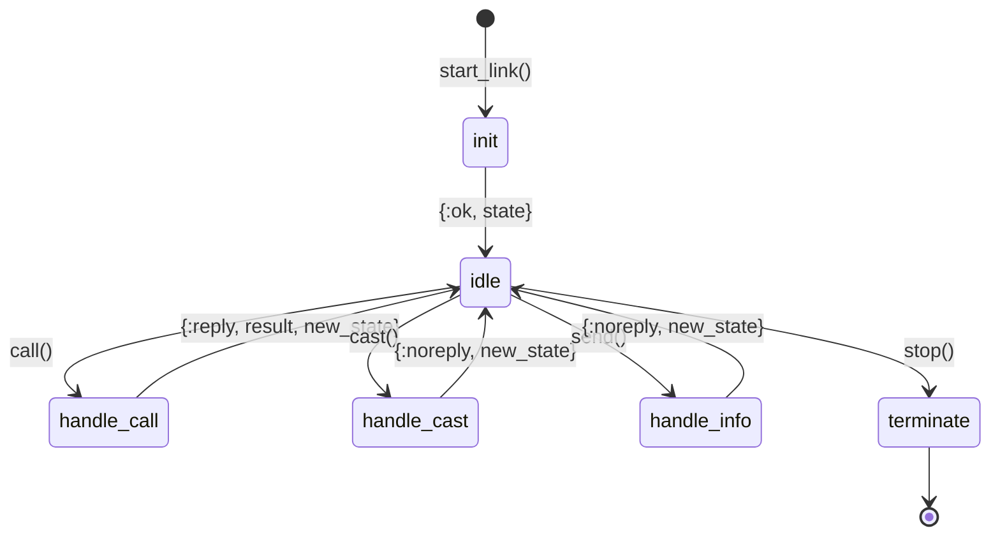
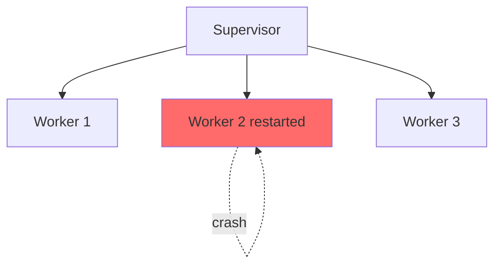
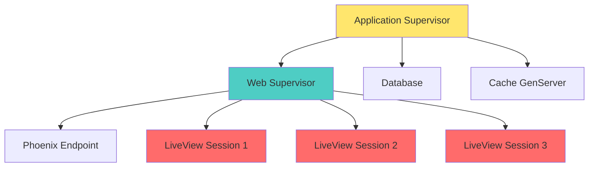

# OTP Essentials — Процессы и Supervisors

> **Важно:** Для задачи NASA это не обязательно! Можно пропустить и вернуться позже.
> 
> Но понимание OTP важно для работы с Elixir в production.

## Что такое OTP?

**OTP (Open Telecom Platform)** — набор библиотек и паттернов для построения надежных, fault-tolerant приложений.

```
OTP = Erlang библиотеки + Best practices для конкурентных систем
```

Основные компоненты:
- **Processes** — легковесные "акторы"
- **GenServer** — паттерн для stateful процессов
- **Supervisor** — менеджер процессов, перезапускает при падении
- **Application** — структура приложения

## Процессы в BEAM

### Что такое процесс?

**НЕ OS процесс!** Это легковесный "актор" внутри BEAM VM.

| Характеристика | OS Thread (Ruby) | BEAM Process (Elixir) |
|----------------|------------------|------------------------|
| Память | ~1-2 MB | ~2 KB |
| Создание | ~1-2 ms | ~1-2 μs (микросекунды!) |
| Переключение | Медленно | Очень быстро |
| Максимум | ~10,000 | ~10,000,000+ |
| Изоляция | Общая память | Полная изоляция |

### Создание процесса

```elixir
# spawn - создать процесс
pid = spawn(fn ->
  IO.puts("Hello from process!")
end)

# Отправить сообщение
send(pid, {:hello, "world"})

# Получить сообщение
receive do
  {:hello, msg} -> IO.puts("Received: #{msg}")
end

# Process ID
self()  # текущий процесс
```

### Пример: параллельные задачи

```elixir
# Ruby - последовательно
urls = ["url1", "url2", "url3"]
results = urls.map { |url| fetch(url) }  # 3 секунды

# Elixir - параллельно
urls = ["url1", "url2", "url3"]
tasks = Enum.map(urls, fn url ->
  Task.async(fn -> fetch(url) end)
end)
results = Task.await_many(tasks)  # 1 секунда!
```

## GenServer — State Management

**GenServer (Generic Server)** — паттерн для процесса с состоянием.

### Сравнение с Ruby

```ruby
# Ruby - глобальная переменная или Singleton
class Counter
  attr_reader :count
  
  def initialize
    @count = 0
  end
  
  def increment
    @count += 1
  end
  
  def get_count
    @count
  end
end

# Проблема: race conditions, не потокобезопасно!
counter = Counter.new
Thread.new { 1000.times { counter.increment } }
Thread.new { 1000.times { counter.increment } }
# count может быть < 2000!
```

```elixir
# Elixir - GenServer
defmodule Counter do
  use GenServer

  # Client API (синхронные функции)
  def start_link(initial_value) do
    GenServer.start_link(__MODULE__, initial_value, name: __MODULE__)
  end

  def increment do
    GenServer.call(__MODULE__, :increment)
  end

  def get_count do
    GenServer.call(__MODULE__, :get_count)
  end

  # Server Callbacks (асинхронно в процессе)
  @impl true
  def init(initial_value) do
    {:ok, initial_value}
  end

  @impl true
  def handle_call(:increment, _from, count) do
    {:reply, count + 1, count + 1}
  end

  @impl true
  def handle_call(:get_count, _from, count) do
    {:reply, count, count}
  end
end

# Использование
{:ok, pid} = Counter.start_link(0)
Counter.increment()  # 1
Counter.increment()  # 2
Counter.get_count()  # 2

# Потокобезопасно! Все запросы последовательны в процессе
```

### GenServer Lifecycle



### call vs cast

```elixir
# call - синхронно, ждет ответа
GenServer.call(pid, :get_value)
# Блокирует до получения ответа

# cast - асинхронно, не ждет
GenServer.cast(pid, {:set_value, 42})
# Сразу возвращает :ok

# info - обычное сообщение (не через GenServer API)
send(pid, :tick)
```

## Supervisor — Fault Tolerance

**Supervisor** — процесс, который следит за другими процессами и перезапускает при падении.

### Философия Erlang/Elixir

```
"Let it crash" — позволь упасть и перезапустись
```

Вместо defensive programming, используем supervision trees.

### Пример

```elixir
defmodule MyApp.Application do
  use Application

  def start(_type, _args) do
    children = [
      # Web endpoint
      MyAppWeb.Endpoint,
      
      # Database connection pool
      {Ecto.Repo, MyApp.Repo},
      
      # Custom workers
      {MyApp.Cache, []},
      {MyApp.Worker, []},
    ]

    # Стратегия: если один падает, перезапусти только его
    opts = [strategy: :one_for_one, name: MyApp.Supervisor]
    Supervisor.start_link(children, opts)
  end
end
```

### Supervision Strategies



| Стратегия | Поведение | Когда использовать |
|-----------|-----------|-------------------|
| **:one_for_one** | Перезапуск только упавшего | Независимые workers |
| **:one_for_all** | Перезапуск всех при падении одного | Зависимые workers |
| **:rest_for_one** | Перезапуск упавшего + всех после него | Последовательные зависимости |

### Supervision Tree



**Преимущества:**
- LiveView session падает → только этот пользователь переподключается
- Cache падает → перезапускается, другие сервисы работают
- DB connection pool падает → переподключается автоматически

## Task — Async Operations

**Task** — простой способ запустить асинхронную работу.

```elixir
# Запустить задачу
task = Task.async(fn ->
  heavy_computation()
end)

# Продолжить работу...
do_other_work()

# Дождаться результата
result = Task.await(task)

# С таймаутом
result = Task.await(task, 5000)  # 5 секунд
```

### Параллельный map

```elixir
# Последовательно
results = Enum.map(urls, &fetch/1)

# Параллельно
results = urls
|> Task.async_stream(&fetch/1, max_concurrency: 10)
|> Enum.to_list()
```

## Agent — Simple State

**Agent** — простая обертка для состояния (проще GenServer).

```elixir
# Создать Agent
{:ok, agent} = Agent.start_link(fn -> %{} end)

# Обновить
Agent.update(agent, fn state ->
  Map.put(state, :count, 0)
end)

# Получить
count = Agent.get(agent, fn state -> state.count end)

# Или именованный
Agent.start_link(fn -> 0 end, name: :counter)
Agent.update(:counter, &(&1 + 1))
Agent.get(:counter, &(&1))
```

**Когда использовать:**
- Agent — для простого state (get/update)
- GenServer — для сложной логики, callbacks

## Registry — Process Discovery

**Registry** — телефонная книга процессов.

```elixir
# Создать registry
{:ok, _} = Registry.start_link(keys: :unique, name: MyApp.Registry)

# Зарегистрировать процесс
{:ok, pid} = GenServer.start_link(MyWorker, [], 
  name: {:via, Registry, {MyApp.Registry, "worker_1"}}
)

# Найти процесс
[{pid, _}] = Registry.lookup(MyApp.Registry, "worker_1")

# Использование: LiveView sessions, Chat rooms, User connections
```

## Практические примеры

### 1. Background Job (как Sidekiq)

```elixir
defmodule MyApp.EmailWorker do
  use GenServer

  def start_link(_) do
    GenServer.start_link(__MODULE__, :ok, name: __MODULE__)
  end

  def send_email(to, subject, body) do
    GenServer.cast(__MODULE__, {:send_email, to, subject, body})
  end

  @impl true
  def init(:ok) do
    {:ok, :no_state}
  end

  @impl true
  def handle_cast({:send_email, to, subject, body}, state) do
    # Отправка email в фоне
    MyApp.Mailer.send(to, subject, body)
    {:noreply, state}
  end
end

# Использование
EmailWorker.send_email("user@example.com", "Hello", "World")
# Возвращает :ok сразу, email отправляется в фоне
```

### 2. Cache с TTL

```elixir
defmodule MyApp.Cache do
  use GenServer

  def start_link(_) do
    GenServer.start_link(__MODULE__, %{}, name: __MODULE__)
  end

  def put(key, value, ttl_ms \\ 60_000) do
    GenServer.cast(__MODULE__, {:put, key, value, ttl_ms})
  end

  def get(key) do
    GenServer.call(__MODULE__, {:get, key})
  end

  @impl true
  def init(_) do
    {:ok, %{}}
  end

  @impl true
  def handle_cast({:put, key, value, ttl_ms}, state) do
    # Запланировать удаление через ttl_ms
    Process.send_after(self(), {:expire, key}, ttl_ms)
    
    new_state = Map.put(state, key, value)
    {:noreply, new_state}
  end

  @impl true
  def handle_call({:get, key}, _from, state) do
    {:reply, Map.get(state, key), state}
  end

  @impl true
  def handle_info({:expire, key}, state) do
    new_state = Map.delete(state, key)
    {:noreply, new_state}
  end
end
```

### 3. Rate Limiter

```elixir
defmodule MyApp.RateLimiter do
  use GenServer

  def start_link(opts) do
    GenServer.start_link(__MODULE__, opts, name: __MODULE__)
  end

  def check_rate(user_id) do
    GenServer.call(__MODULE__, {:check_rate, user_id})
  end

  @impl true
  def init(opts) do
    max_requests = Keyword.get(opts, :max_requests, 100)
    window_ms = Keyword.get(opts, :window_ms, 60_000)
    
    state = %{
      max_requests: max_requests,
      window_ms: window_ms,
      requests: %{}
    }
    
    {:ok, state}
  end

  @impl true
  def handle_call({:check_rate, user_id}, _from, state) do
    now = System.monotonic_time(:millisecond)
    user_requests = Map.get(state.requests, user_id, [])
    
    # Фильтр: только запросы в текущем окне
    recent_requests = Enum.filter(user_requests, fn timestamp ->
      now - timestamp < state.window_ms
    end)
    
    if length(recent_requests) < state.max_requests do
      # Разрешить
      new_requests = [now | recent_requests]
      new_state = put_in(state.requests[user_id], new_requests)
      {:reply, :ok, new_state}
    else
      # Превышен лимит
      {:reply, {:error, :rate_limit_exceeded}, state}
    end
  end
end
```

## Когда использовать OTP?

### ✅ Используй GenServer для:
- State management (cache, config, counters)
- Background workers
- Connection pools
- Rate limiters
- Pub/Sub subscribers

### ✅ Используй Task для:
- Async operations (API calls, DB queries)
- Параллельная обработка списков
- Fire-and-forget jobs

### ✅ Используй Supervisor для:
- Управление жизненным циклом процессов
- Автоматический рестарт при падениях
- Graceful shutdown

### ❌ НЕ используй для:
- Простых вычислений (используй обычные функции)
- HTTP requests (используй обычные контроллеры)
- Одноразовых скриптов

## Для задачи NASA

**OTP НЕ нужен для задачи NASA!**

Расчет топлива — это чистая функция без состояния.

```elixir
# Достаточно простой функции
def calculate_fuel(mass, steps) do
  # ...
end

# GenServer НЕ нужен! Нет состояния.
```

**Когда OTP был бы полезен в NASA задаче:**
- Если нужен кэш результатов → GenServer
- Если нужна очередь расчетов → GenServer + Queue
- Если нужен real-time мониторинг → PubSub + LiveView
- Если нужна история миссий → GenServer state

Но для простого калькулятора — **чистые функции достаточно**.

## Чеклист понимания OTP

- ✅ Процессы легковесны, можно миллионы
- ✅ GenServer = процесс с состоянием
- ✅ Supervisor перезапускает упавшие процессы
- ✅ Task для параллельных операций
- ✅ "Let it crash" философия
- ✅ Supervision tree для структуры приложения
- ✅ Не нужен для простых функций!

## Следующий шаг

Переходи к **06-cheatsheet.md** для quick reference или к **07-project-setup.md** для установки окружения.

---

**Полезные ссылки:**
- [GenServer Guide](https://hexdocs.pm/elixir/GenServer.html)
- [Supervisor and Application](https://elixir-lang.org/getting-started/mix-otp/supervisor-and-application.html)
- [Task Documentation](https://hexdocs.pm/elixir/Task.html)

