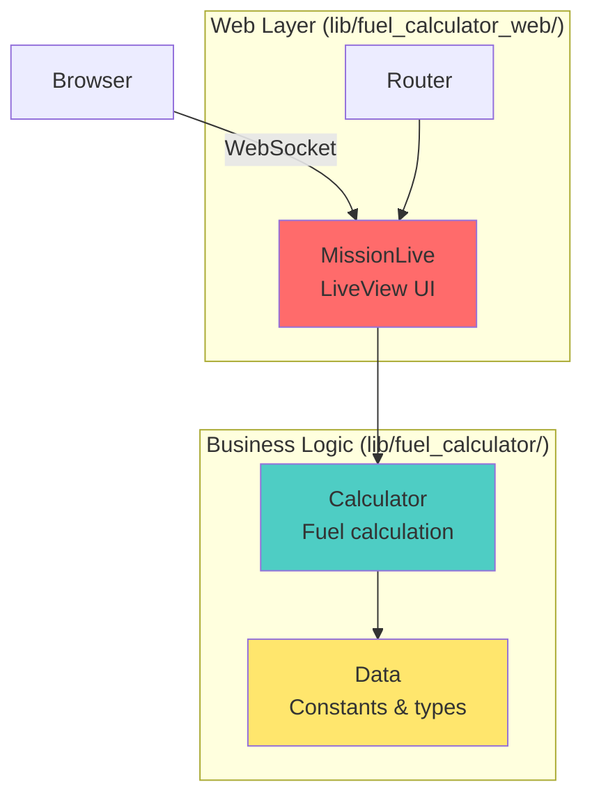

# Разбор задачи NASA: Fuel Calculator

## Обзор задачи

Нужно создать Phoenix LiveView приложение для расчета топлива межпланетных полетов.

### Входные данные:
- Масса корабля (кг)
- Последовательность шагов: `[{action, planet}, ...]`
  - action: `:launch` или `:land`
  - planet: `:earth`, `:moon`, `:mars`

### Выходные данные:
- Общее количество топлива (кг)

### Формулы:
- **Launch:** `mass * gravity * 0.042 - 33` (округление вниз)
- **Landing:** `mass * gravity * 0.033 - 42` (округление вниз)
- **Рекурсия:** топливо добавляет вес → нужно топливо для топлива → пока не станет ≤ 0

## Архитектура решения



## Структура проекта

```
fuel_calculator/
├── lib/
│   ├── fuel_calculator/          # Бизнес-логика
│   │   ├── calculator.ex         # Расчет топлива
│   │   └── constants.ex          # Гравитация планет
│   └── fuel_calculator_web/      # Web интерфейс
│       ├── live/
│       │   └── mission_live.ex   # LiveView компонент
│       └── router.ex
├── test/
│   └── fuel_calculator/
│       └── calculator_test.exs   # Тесты с примерами из задачи
└── mix.exs
```

## Пошаговый план реализации

### Шаг 1: Создание проекта

```bash
mix phx.new fuel_calculator --no-ecto --no-mailer --no-dashboard
cd fuel_calculator
```

**Флаги:**
- `--no-ecto` — не нужна БД
- `--no-mailer` — не нужна почта
- `--no-dashboard` — не нужен LiveDashboard

### Шаг 2: Модуль с константами

```elixir
# lib/fuel_calculator/constants.ex
defmodule FuelCalculator.Constants do
  @moduledoc """
  Константы для расчета топлива
  """

  @planets %{
    earth: 9.807,
    moon: 1.62,
    mars: 3.711
  }

  @launch_multiplier 0.042
  @launch_offset 33

  @landing_multiplier 0.033
  @landing_offset 42

  def gravity(planet), do: Map.fetch!(@planets, planet)
  def launch_multiplier, do: @launch_multiplier
  def launch_offset, do: @launch_offset
  def landing_multiplier, do: @landing_multiplier
  def landing_offset, do: @landing_offset
  
  def planets, do: Map.keys(@planets)
end
```

### Шаг 3: Модуль расчета топлива

```elixir
# lib/fuel_calculator/calculator.ex
defmodule FuelCalculator.Calculator do
  @moduledoc """
  Расчет необходимого топлива для межпланетных полетов
  """

  alias FuelCalculator.Constants

  @doc """
  Рассчитывает общее топливо для всего полета
  
  ## Examples
  
      iex> steps = [{:launch, :earth}, {:land, :moon}]
      iex> Calculator.calculate_total(28801, steps)
      51898
  """
  def calculate_total(mass, steps) when is_integer(mass) and mass > 0 do
    Enum.reduce(steps, 0, fn step, total_fuel ->
      fuel = calculate_step(mass + total_fuel, step)
      total_fuel + fuel
    end)
  end
  
  def calculate_total(_mass, _steps), do: 0

  @doc """
  Рассчитывает топливо для одного шага (launch или land)
  """
  def calculate_step(mass, {action, planet}) do
    gravity = Constants.gravity(planet)
    
    initial_fuel = case action do
      :launch -> calculate_launch(mass, gravity)
      :land -> calculate_landing(mass, gravity)
    end
    
    # Рекурсивный расчет: топливо для топлива
    calculate_fuel_for_fuel(initial_fuel, action, gravity)
  end

  # Расчет топлива для взлета
  defp calculate_launch(mass, gravity) do
    (mass * gravity * Constants.launch_multiplier() - Constants.launch_offset())
    |> floor()
    |> max(0)
  end

  # Расчет топлива для посадки
  defp calculate_landing(mass, gravity) do
    (mass * gravity * Constants.landing_multiplier() - Constants.landing_offset())
    |> floor()
    |> max(0)
  end

  # Рекурсивный расчет: топливо добавляет вес
  defp calculate_fuel_for_fuel(fuel, action, gravity, acc \\ 0)
  
  defp calculate_fuel_for_fuel(fuel, _action, _gravity, acc) when fuel <= 0 do
    acc
  end
  
  defp calculate_fuel_for_fuel(fuel, action, gravity, acc) do
    additional_fuel = case action do
      :launch -> calculate_launch(fuel, gravity)
      :land -> calculate_landing(fuel, gravity)
    end
    
    calculate_fuel_for_fuel(additional_fuel, action, gravity, acc + fuel)
  end
end
```

**Ключевые моменты:**
- `calculate_total/2` — главная функция, суммирует топливо по шагам
- `calculate_step/2` — топливо для одного действия
- `calculate_fuel_for_fuel/4` — рекурсия для топлива топлива (tail-recursive!)
- Pattern matching: `{:launch, :earth}` и guards `when mass > 0`

### Шаг 4: Тесты (с примерами из задачи!)

```elixir
# test/fuel_calculator/calculator_test.exs
defmodule FuelCalculator.CalculatorTest do
  use ExUnit.Case
  alias FuelCalculator.Calculator

  describe "calculate_total/2" do
    test "Apollo 11 Mission" do
      # Path: launch Earth, land Moon, launch Moon, land Earth
      # Equipment mass: 28801 kg
      # Total fuel: 51898 kg
      steps = [
        {:launch, :earth},
        {:land, :moon},
        {:launch, :moon},
        {:land, :earth}
      ]
      
      assert Calculator.calculate_total(28801, steps) == 51898
    end

    test "Mars Mission" do
      # Path: launch Earth, land Mars, launch Mars, land Earth
      # Equipment mass: 14606 kg
      # Total fuel: 33388 kg
      steps = [
        {:launch, :earth},
        {:land, :mars},
        {:launch, :mars},
        {:land, :earth}
      ]
      
      assert Calculator.calculate_total(14606, steps) == 33388
    end

    test "Passenger Ship Mission" do
      # Path: launch Earth, land Moon, launch Moon, land Mars, 
      #       launch Mars, land Earth
      # Equipment mass: 75432 kg
      # Total fuel: 212161 kg
      steps = [
        {:launch, :earth},
        {:land, :moon},
        {:launch, :moon},
        {:land, :mars},
        {:launch, :mars},
        {:land, :earth}
      ]
      
      assert Calculator.calculate_total(75432, steps) == 212161
    end

    test "single step: land on Earth (from task example)" do
      # 28801 kg landing on Earth = 13447 fuel
      # (includes fuel for fuel)
      assert Calculator.calculate_step(28801, {:land, :earth}) == 13447
    end

    test "zero mass returns zero fuel" do
      steps = [{:launch, :earth}]
      assert Calculator.calculate_total(0, steps) == 0
    end

    test "empty steps return zero fuel" do
      assert Calculator.calculate_total(1000, []) == 0
    end
  end
end
```

### Шаг 5: LiveView интерфейс

```elixir
# lib/fuel_calculator_web/live/mission_live.ex
defmodule FuelCalculatorWeb.MissionLive do
  use FuelCalculatorWeb, :live_view
  
  alias FuelCalculator.{Calculator, Constants}

  @impl true
  def mount(_params, _session, socket) do
    socket = assign(socket,
      mass: 28801,           # Дефолтное значение (Apollo 11)
      steps: [],             # Шаги полета
      total_fuel: 0,         # Результат
      planets: Constants.planets()
    )
    
    {:ok, socket}
  end

  @impl true
  def render(assigns) do
    ~H"""
    <div class="max-w-4xl mx-auto p-8">
      <h1 class="text-4xl font-bold mb-8">🚀 NASA Fuel Calculator</h1>
      
      <!-- Масса корабля -->
      <div class="mb-8">
        <label class="label">
          <span class="label-text">Spacecraft Mass (kg)</span>
        </label>
        <input 
          type="number" 
          name="mass"
          value={@mass}
          phx-change="update_mass"
          phx-debounce="300"
          class="input input-bordered w-full"
          min="0"
        />
      </div>
      
      <!-- Список шагов -->
      <div class="mb-8">
        <h2 class="text-2xl font-bold mb-4">Flight Path</h2>
        
        <%= if @steps == [] do %>
          <div class="alert alert-info">
            <span>Add steps to build your flight path</span>
          </div>
        <% else %>
          <div class="space-y-2">
            <%= for {step, index} <- Enum.with_index(@steps) do %>
              <div class="flex gap-2 items-center">
                <span class="text-lg font-mono"><%= index + 1 %>.</span>
                
                <!-- Action selector -->
                <select 
                  class="select select-bordered"
                  phx-change="update_action"
                  phx-value-index={index}
                >
                  <option value="launch" selected={step.action == :launch}>
                    Launch
                  </option>
                  <option value="land" selected={step.action == :land}>
                    Land
                  </option>
                </select>
                
                <!-- Planet selector -->
                <select 
                  class="select select-bordered"
                  phx-change="update_planet"
                  phx-value-index={index}
                >
                  <%= for planet <- @planets do %>
                    <option 
                      value={planet} 
                      selected={step.planet == planet}
                    >
                      <%= planet |> Atom.to_string() |> String.capitalize() %>
                    </option>
                  <% end %>
                </select>
                
                <!-- Remove button -->
                <button 
                  class="btn btn-error btn-sm"
                  phx-click="remove_step"
                  phx-value-index={index}
                >
                  ✕
                </button>
              </div>
            <% end %>
          </div>
        <% end %>
        
        <button 
          class="btn btn-primary mt-4"
          phx-click="add_step"
        >
          + Add Step
        </button>
      </div>
      
      <!-- Результат -->
      <div class="card bg-base-200 shadow-xl">
        <div class="card-body">
          <h2 class="card-title">Total Fuel Required</h2>
          <p class="text-4xl font-bold text-primary">
            <%= @total_fuel %> kg
          </p>
        </div>
      </div>
    </div>
    """
  end

  @impl true
  def handle_event("update_mass", %{"value" => mass_str}, socket) do
    mass = parse_positive_integer(mass_str, 0)
    
    socket = socket
    |> assign(:mass, mass)
    |> recalculate_fuel()
    
    {:noreply, socket}
  end

  @impl true
  def handle_event("add_step", _params, socket) do
    new_step = %{action: :launch, planet: :earth}
    steps = socket.assigns.steps ++ [new_step]
    
    socket = socket
    |> assign(:steps, steps)
    |> recalculate_fuel()
    
    {:noreply, socket}
  end

  @impl true
  def handle_event("remove_step", %{"index" => index_str}, socket) do
    index = String.to_integer(index_str)
    steps = List.delete_at(socket.assigns.steps, index)
    
    socket = socket
    |> assign(:steps, steps)
    |> recalculate_fuel()
    
    {:noreply, socket}
  end

  @impl true
  def handle_event("update_action", params, socket) do
    %{"index" => index_str, "value" => action_str} = params
    index = String.to_integer(index_str)
    action = String.to_atom(action_str)
    
    steps = List.update_at(socket.assigns.steps, index, fn step ->
      %{step | action: action}
    end)
    
    socket = socket
    |> assign(:steps, steps)
    |> recalculate_fuel()
    
    {:noreply, socket}
  end

  @impl true
  def handle_event("update_planet", params, socket) do
    %{"index" => index_str, "value" => planet_str} = params
    index = String.to_integer(index_str)
    planet = String.to_atom(planet_str)
    
    steps = List.update_at(socket.assigns.steps, index, fn step ->
      %{step | planet: planet}
    end)
    
    socket = socket
    |> assign(:steps, steps)
    |> recalculate_fuel()
    
    {:noreply, socket}
  end

  # Пересчет топлива при любом изменении
  defp recalculate_fuel(socket) do
    %{mass: mass, steps: steps} = socket.assigns
    
    # Конвертируем в формат для Calculator
    calculator_steps = Enum.map(steps, fn step ->
      {step.action, step.planet}
    end)
    
    total_fuel = Calculator.calculate_total(mass, calculator_steps)
    
    assign(socket, :total_fuel, total_fuel)
  end

  # Безопасный парсинг числа
  defp parse_positive_integer(str, default) do
    case Integer.parse(str) do
      {n, _} when n >= 0 -> n
      _ -> default
    end
  end
end
```

### Шаг 6: Routing

```elixir
# lib/fuel_calculator_web/router.ex
defmodule FuelCalculatorWeb.Router do
  use FuelCalculatorWeb, :router

  pipeline :browser do
    plug :accepts, ["html"]
    plug :fetch_session
    plug :fetch_live_flash
    plug :put_root_layout, html: {FuelCalculatorWeb.Layouts, :root}
    plug :protect_from_forgery
    plug :put_secure_browser_headers
  end

  scope "/", FuelCalculatorWeb do
    pipe_through :browser

    live "/", MissionLive
  end
end
```

## Flow данных в приложении

```
┌─────────────────────────────────────────────────────────┐
│                       Browser                           │
│  ┌──────────────────────────────────────────────────┐   │
│  │  Input: mass = 28801                             │   │
│  │  Steps: [{launch, earth}, {land, moon}]          │   │
│  │  Result: Total fuel = 51898 kg                   │   │
│  └──────────────────────────────────────────────────┘   │
└──────────────────┬──────────────────▲───────────────────┘
                   │                  │
            WebSocket Event      WebSocket Diff
                   │                  │
┌──────────────────▼──────────────────┴───────────────────┐
│              MissionLive (LiveView)                     │
│  ┌────────────────────────────────────────────────┐     │
│  │ State (assigns):                               │     │
│  │   mass: 28801                                  │     │
│  │   steps: [%{action: :launch, planet: :earth}]  │     │
│  │   total_fuel: 0                                │     │
│  └────────────────────────────────────────────────┘     │
│                       │                                  │
│            handle_event("update_mass", ...)             │
│            handle_event("add_step", ...)                │
│                       │                                  │
│              recalculate_fuel()                          │
│                       │                                  │
└───────────────────────┼──────────────────────────────────┘
                        │
┌───────────────────────▼──────────────────────────────────┐
│              Calculator (Business Logic)                 │
│  ┌────────────────────────────────────────────────┐      │
│  │ calculate_total(mass, steps)                   │      │
│  │   └─> calculate_step(mass, {action, planet})   │      │
│  │         └─> calculate_fuel_for_fuel(...)       │      │
│  │                                                 │      │
│  │ Returns: 51898                                 │      │
│  └────────────────────────────────────────────────┘      │
└──────────────────────────────────────────────────────────┘
```

## Типичные ошибки и как их избежать

### ❌ Ошибка 1: Забыть пересчитать при изменении
```elixir
# Плохо - забыли пересчитать
def handle_event("add_step", _, socket) do
  steps = socket.assigns.steps ++ [new_step]
  {:noreply, assign(socket, :steps, steps)}
end
```

```elixir
# Хорошо - всегда пересчитываем
def handle_event("add_step", _, socket) do
  steps = socket.assigns.steps ++ [new_step]
  
  socket = socket
  |> assign(:steps, steps)
  |> recalculate_fuel()  # ← не забыть!
  
  {:noreply, socket}
end
```

### ❌ Ошибка 2: Неправильное округление
```elixir
# Плохо - round() округляет к ближайшему
fuel = round(mass * gravity * 0.042 - 33)

# Хорошо - floor() округляет вниз
fuel = floor(mass * gravity * 0.042 - 33)
```

### ❌ Ошибка 3: Не учитывать отрицательное топливо
```elixir
# Плохо - может вернуть отрицательное
defp calculate_launch(mass, gravity) do
  floor(mass * gravity * 0.042 - 33)
end

# Хорошо - минимум 0
defp calculate_launch(mass, gravity) do
  (mass * gravity * 0.042 - 33)
  |> floor()
  |> max(0)
end
```

### ❌ Ошибка 4: Не остановить рекурсию
```elixir
# Плохо - бесконечная рекурсия если fuel == 0
defp calculate_fuel_for_fuel(fuel, action, gravity, acc) do
  additional = calculate(fuel, action, gravity)
  calculate_fuel_for_fuel(additional, action, gravity, acc + fuel)
end

# Хорошо - base case
defp calculate_fuel_for_fuel(fuel, _, _, acc) when fuel <= 0 do
  acc
end
```

### ❌ Ошибка 5: Мутировать список напрямую
```elixir
# Плохо - в Elixir так нельзя!
socket.assigns.steps[index].action = :land  # ← Error!

# Хорошо - создать новый список
steps = List.update_at(socket.assigns.steps, index, fn step ->
  %{step | action: :land}
end)
```

## Улучшения (опциональные)

### 1. Валидация формы
```elixir
def handle_event("update_mass", %{"value" => mass_str}, socket) do
  case Integer.parse(mass_str) do
    {mass, _} when mass >= 0 ->
      socket = socket
      |> assign(:mass, mass)
      |> assign(:mass_error, nil)
      |> recalculate_fuel()
      
      {:noreply, socket}
    
    _ ->
      socket = assign(socket, :mass_error, "Must be a positive number")
      {:noreply, socket}
  end
end
```

### 2. Показать детали расчета
```elixir
# Добавить в state
breakdown: [
  %{step: "Launch Earth", fuel: 25123},
  %{step: "Land Moon", fuel: 5432},
  ...
]

# Показать в UI
<div class="breakdown">
  <%= for item <- @breakdown do %>
    <div><%= item.step %>: <%= item.fuel %> kg</div>
  <% end %>
</div>
```

### 3. Presets (предзаполненные миссии)
```elixir
def handle_event("load_preset", %{"mission" => "apollo11"}, socket) do
  socket = socket
  |> assign(:mass, 28801)
  |> assign(:steps, [
    %{action: :launch, planet: :earth},
    %{action: :land, planet: :moon},
    %{action: :launch, planet: :moon},
    %{action: :land, planet: :earth}
  ])
  |> recalculate_fuel()
  
  {:noreply, socket}
end
```

## Запуск и тестирование

```bash
# Запустить тесты
mix test

# Запустить сервер
mix phx.server

# Открыть в браузере
open http://localhost:4000
```

## Чеклист готовности

- ✅ Создан модуль `Calculator` с функцией `calculate_total/2`
- ✅ Правильные формулы (launch, landing) с округлением вниз
- ✅ Рекурсивный расчет топлива для топлива
- ✅ Тесты проходят с примерами из задачи (51898, 33388, 212161)
- ✅ LiveView с полями: масса + список шагов
- ✅ Динамическое добавление/удаление шагов
- ✅ Real-time расчет при изменениях
- ✅ Валидация (масса > 0)
- ✅ DaisyUI для стилей (если Phoenix 1.8-rc)

## Следующие шаги

1. Изучи **04-otp-essentials.md** если хочешь понять OTP (опционально)
2. Изучи **06-cheatsheet.md** для quick reference при кодинге
3. Изучи **07-project-setup.md** для установки и настройки окружения
4. Начинай кодить! 🚀

---

**Полезные ссылки для задачи:**
- [Phoenix Generators](https://hexdocs.pm/phoenix/Mix.Tasks.Phx.Gen.Html.html)
- [LiveView Bindings](https://hexdocs.pm/phoenix_live_view/bindings.html)
- [ExUnit Testing](https://hexdocs.pm/ex_unit/ExUnit.html)

